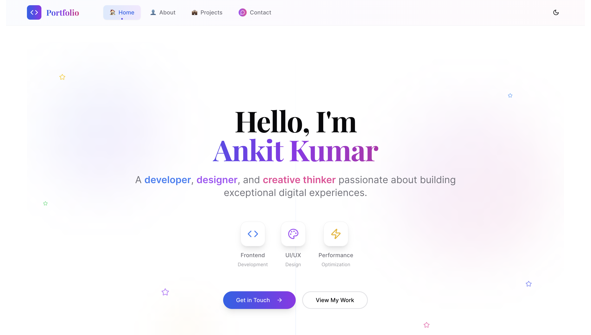

# Portfolio - Ankit Kumar



A modern, responsive portfolio website built with React, TypeScript, and Tailwind CSS.

## Features

- ⚡ Built with Vite for fast development and building
- 🎨 Modern UI with Tailwind CSS and shadcn/ui components
- 📱 Fully responsive design
- 🌙 Dark/Light theme toggle
- 📧 Contact form integration
- 🔧 TypeScript for type safety

## Tech Stack

- React 18
- TypeScript
- Tailwind CSS
- Vite
- shadcn/ui components
- Bun (package manager)

## Getting Started

1. Install dependencies:
```bash
bun install
```

2. Start the development server:
```bash
bun dev
```

3. Build for production:
```bash
bun build
```

## Live Demo

Visit the live portfolio: [Portfolio - Ankit Kumar](https://github.com/Ankitkumar72177/Portfolio-Ankit-kumar)

## Contact

- Email: ak5569387@gmail.com
- GitHub: [@Ankitkumar72177](https://github.com/Ankitkumar72177)
